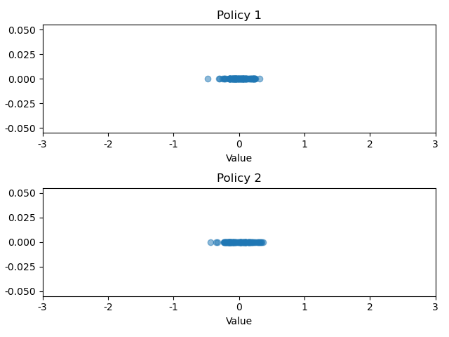
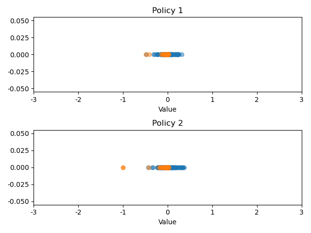

## 设定环境
本次实验构建了一个简易的智能体交互环境，其中策略设置为两个
- 均匀分布
- 高斯分布策略
```python
self.r_independent = np.random.normal(0, 1, n)
```
奖励对应两个：
- 上下文无关奖励，只与状态相关，服从高斯分布
- 上下文相关奖励，与前后状态相关
```python
dis_pre_g = abs(st - self.goal_point) # 上一状态与目标的距离
dis_cur_g = abs(st_ - self.goal_point) # 当前状态与目标的距离
# 离目标更近，则给奖励
if dis_cur_g <= dis_pre_g:
    r = abs(dis_cur_g - dis_pre_g) / self.n
else:
    r =  -abs(dis_cur_g - dis_pre_g) / self.n

dis_pre_d = abs(st - self.dead_point) # 上一状态与终止点的距离
dis_cur_d = abs(st_ - self.dead_point) # 上一状态与终止点的距离
# 离终止点更近，给与惩罚
if dis_cur_d <= dis_pre_d:
    p = abs(dis_cur_d - dis_pre_d) / self.n
else:
    p = -abs(dis_cur_d - dis_pre_d) / self.n

r_total = r - p
```

## 进行实验
对两种奖励环境分别采用两种策略进行采样，将每个epoch的平均奖励保存制作散点图，横坐标为奖励值;
通过实验发现:
上下文无关奖励的环境下，获取到的奖励与策略的关系不大，理论上不存在最优策略;


但上下文相关的奖励环境，与所采用策略相关，理论上这种奖励在最优策略下可以达到最优奖励;

 