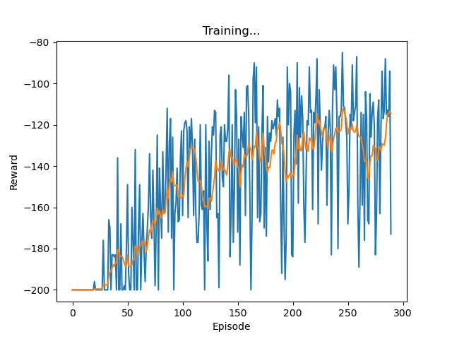

## DDQN模型，已经测试完成


可以通过python ./test_cartpole.py测试

##  环境设计

```python
import numpy as np
class Channel_Env:
        def __init__(self, channel_num, adj_matrix, q_noise_net):
        self.channel_num = channel_num
        self.adj_ma = adj_matrix

        self.state = np.clip(np.random.randn(channel_num), 0, 0.3)  ### 正常的信道值很低，0.3以下
        self.channel_idx = 0
        self.q_noise_net = q_noise_net


    def step(self, act, act_noise):
        """
            act是我们Agent选择的动作，理论上应该是[0~10],表示选择了第n个信道
            act_noise是干扰
            如果所有的信道都被干扰，那么done=True
        """
    

    def reset(self):
        """
        重置状态，全部置为0，默认全0为初始状态
        """
        self.state = np.clip(np.random.randn(self.channel_num), 0, 0.3)  ### 正常的信道值很低，0.3以下
        return self.state


    def random_noise(self):
        """
        随机干扰
        :return:
        """
    

    def cyclic_noise(self):
        """
        扫频干扰
        :return:
        """
        

    def q_learning_noise(self):
        """
        利用noise网络来选择信道干扰
        :return:
        """

```
目前是这样设置的，增加了3种干扰方式，由于状态是连续的，因此用q_learning不适合；改成DQN；

训练使用train.py进行训练；只是简单的展示；

如果后续需要增加一些简单功能，可以继续提出